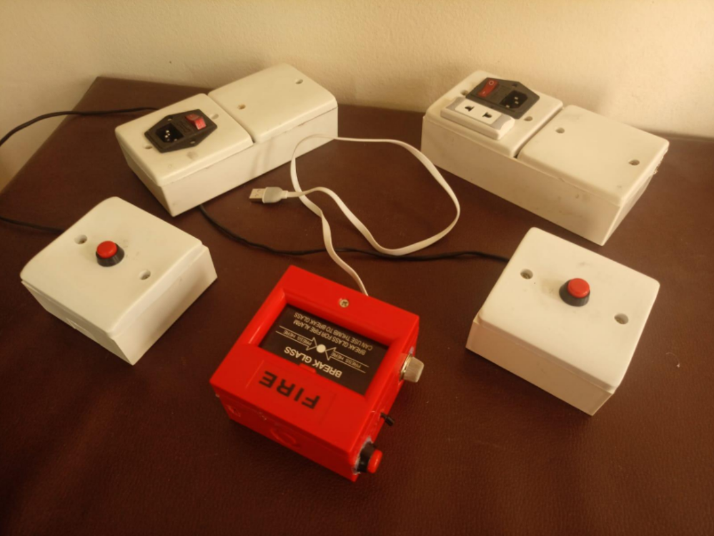
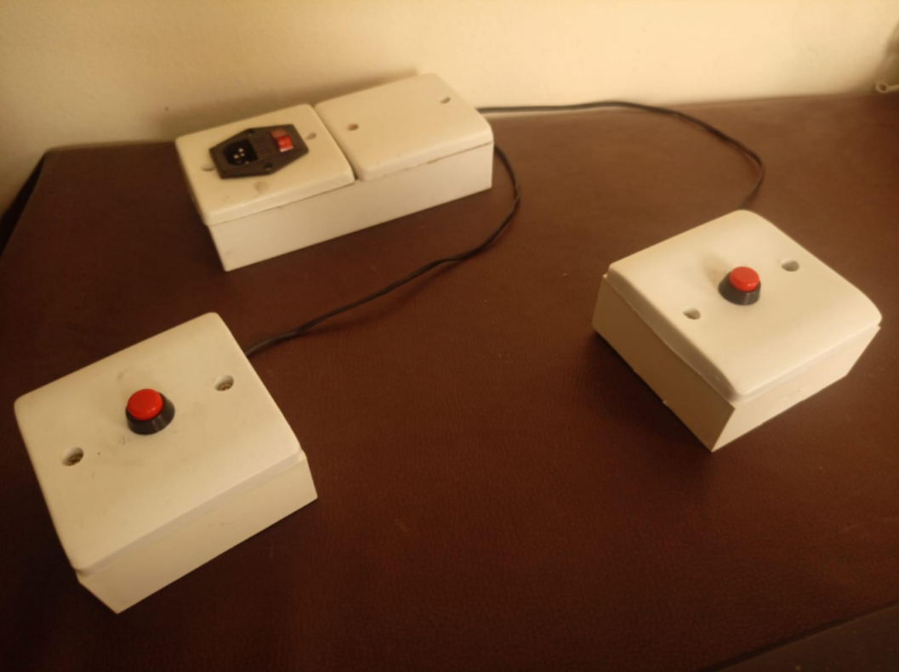
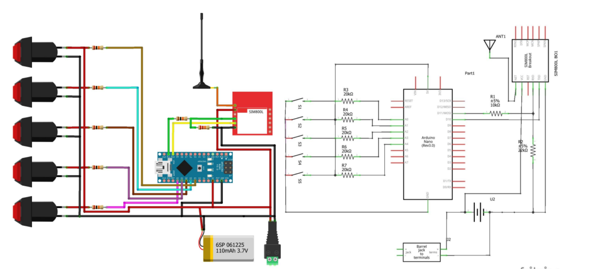
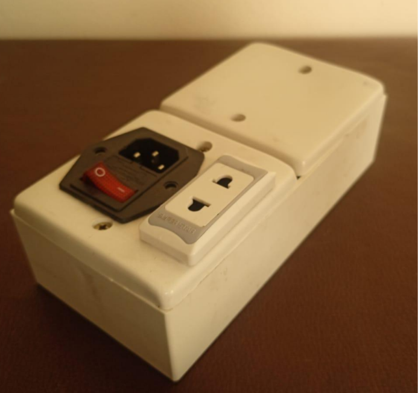
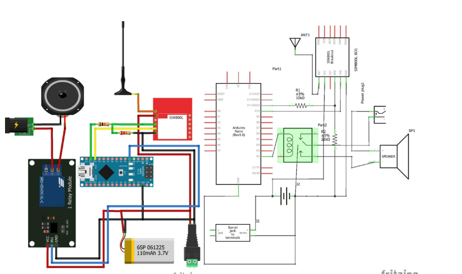
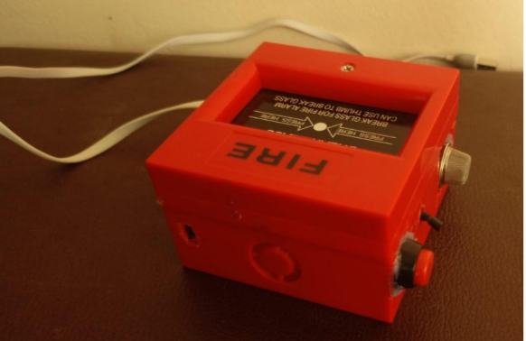
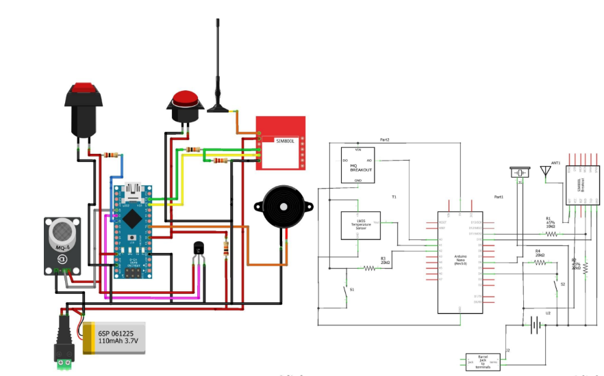
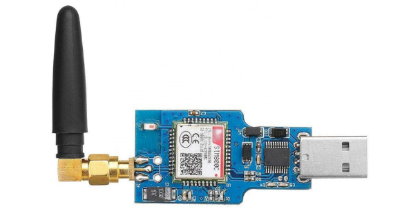

# IoT Devices for Disaster Risk Reduction

This project consists of 3 IoT devices developed for disaster risk reduction and emergency response.

## Device Overview

There are 3 devices:

### Device 1: Manual Call Point with Multiple Switches

If someone presses those switches, a SMS will go to the server.

**Phone number:** 01907808281

### Device 2: SMS Based Warning System

This is a SMS based warning system that will turn on the strobe horn when it receives a SMS from Server with a specific syntax.

**Phone number:** 01907808282

### Device 3: IoT Fire Detection Device

This is an IoT device that will detect heat or smoke or manual pressing and response to the server both using GPS and GPRS.

**Phone number:** 01907808283

## Additional Components

### GSM & GPRS Module for Server

**Phone number:** 01907808284

### Mobile

**Phone number:** 01907808285

## System Architecture

The devices work together as follows:

- **Device 1** sends SMS to server when switches are pressed
- **Device 2** receives SMS commands from server to activate strobe horn
- **Device 3** detects emergencies and sends GPS location via GPRS to server
- **Server module** coordinates communication between all devices
- **Mobile** receives notifications and updates

## Installation

1. Install the devices in appropriate locations
2. Ensure all devices have proper power supply and backup batteries
3. Test SMS communication between devices and server
4. Configure GPS and GPRS settings for Device 3

## Usage

### Device 1 - Manual Activation
Press any of the emergency switches to send SMS alert to server

### Device 2 - Remote Alarm Control  
Server sends SMS with specific syntax to activate strobe horn

### Device 3 - Automatic Detection
Device automatically detects heat, smoke, or manual button press and reports location to server via GPS and GPRS

## Phone Numbers

- Device 1 (Manual Call Point): **01907808281**
- Device 2 (SMS Warning): **01907808282** 
- Device 3 (IoT Detector): **01907808283**
- Server Module: **01907808284**
- Mobile: **01907808285**

## Files

The repository contains the Arduino code for each device:

- `call_point/` - Code for Device 1
- `Relay_gsm/` - Code for Device 2  
- `GPRS_beta/` - Code for Device 3
- `multiswitch_registration/` - Additional multi-switch functionality
